# Lab: Mastering Methods and Encapsulation
## Author: Nicholo Pardines

### 1.Designing Methods
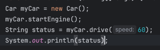
Prediction: A
Outcome: A

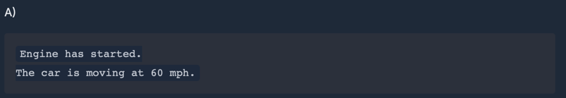
#### Mini-Challenge
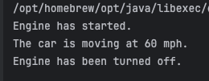
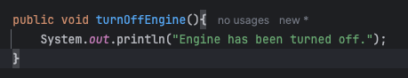

### 2: Passing Parameters: Primitives vs. Objects
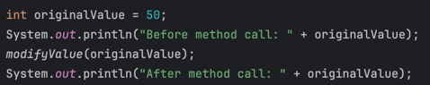
Prediction: B
Outcome: B

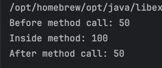

### Mini-Challenge
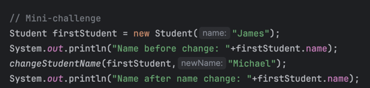
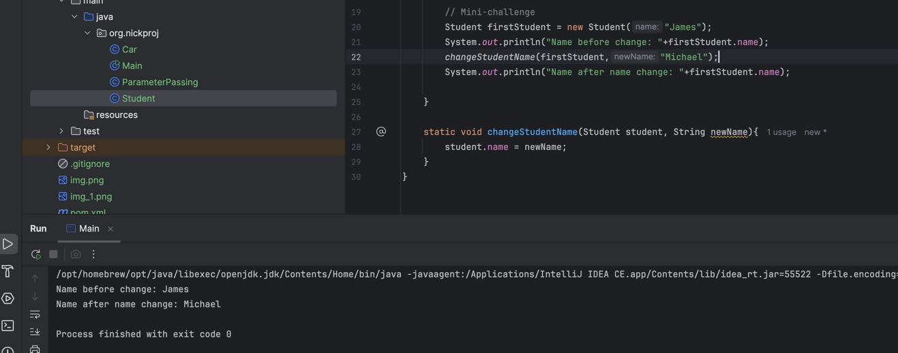

### 3: Using VarArgs
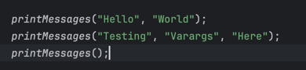
Prediction: A
Outcome:

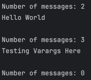
#### Mini-Challenge (findLargest)
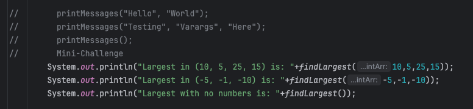
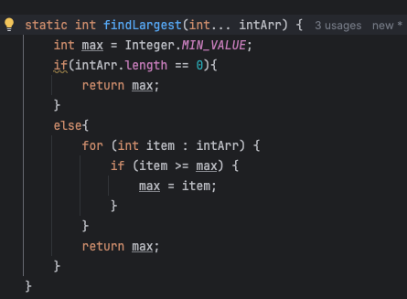

### 4: Access Specifiers
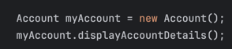
Prediction: A
Outcome:

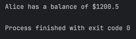
#### Mini-Challenge (SmartDoor)
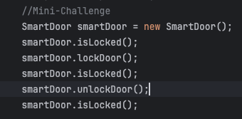
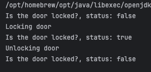
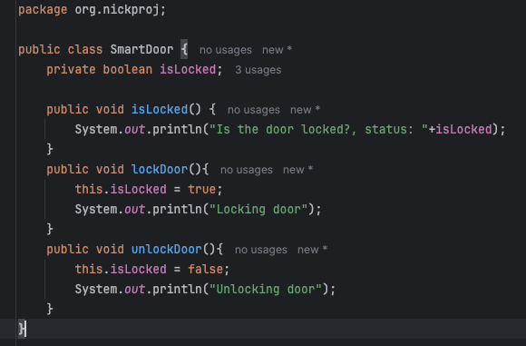

### 5: Static Methods and Variables
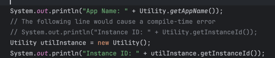
Prediction: A
Outcome:

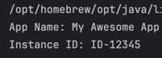

### Converter Mini-Challenge
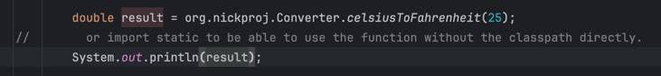
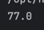

### 6: Method Overloading
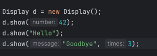
Prediction: A
Outcome: A

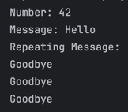

### Converter with Overload
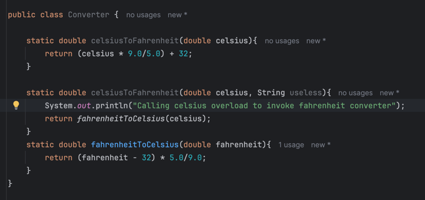
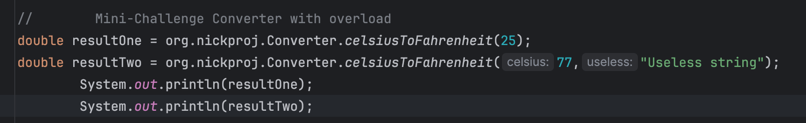
Result:

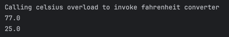

### Lab 7: Constructors and Constructor Overloading
Prediction: A

Output: A

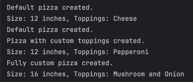

#### Mini-Challenge (Computer)
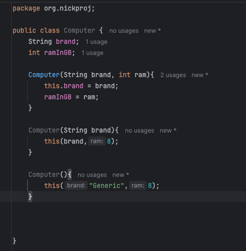
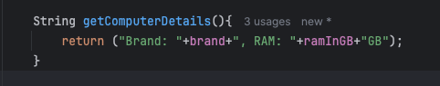
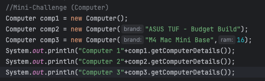
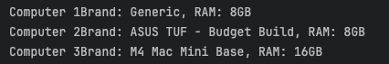

### 8: Encapsulation
Prediction: B

Outcome: B
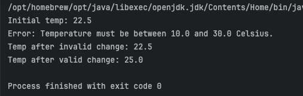

#### Mini-Challenge:
